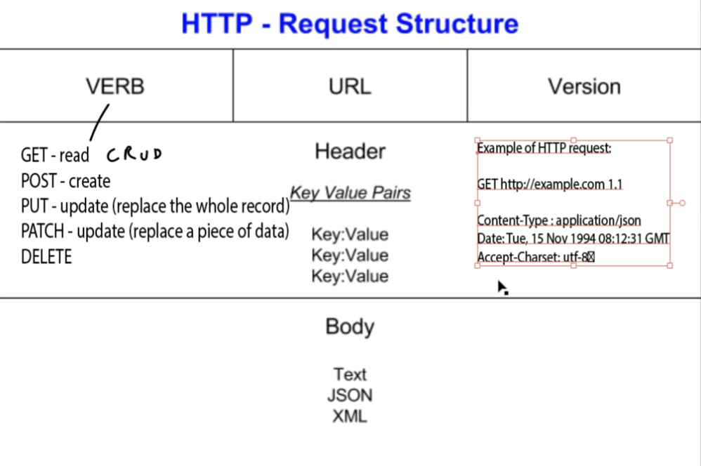
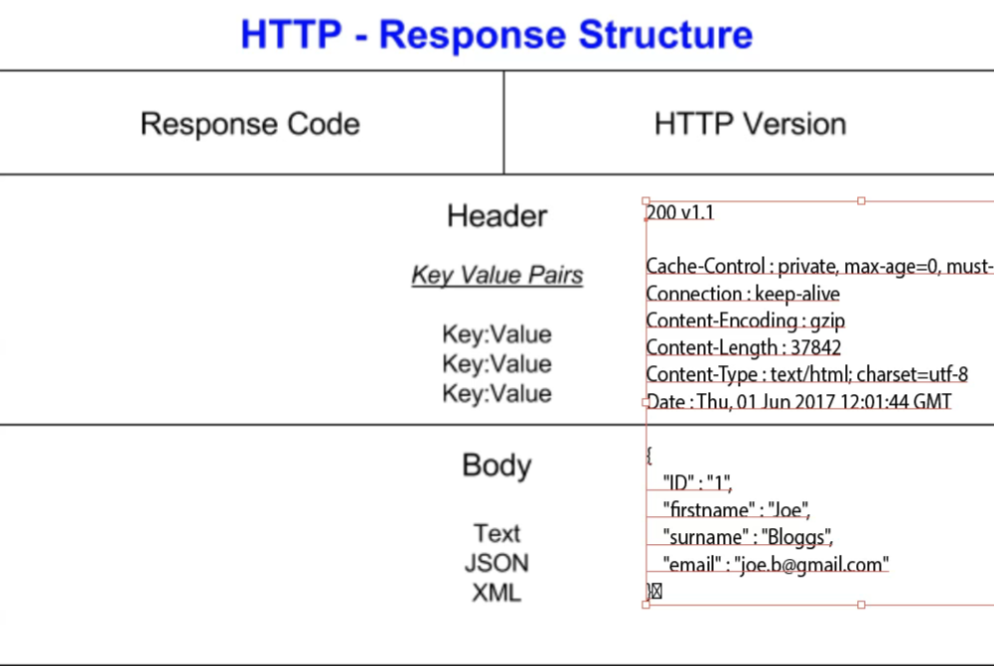
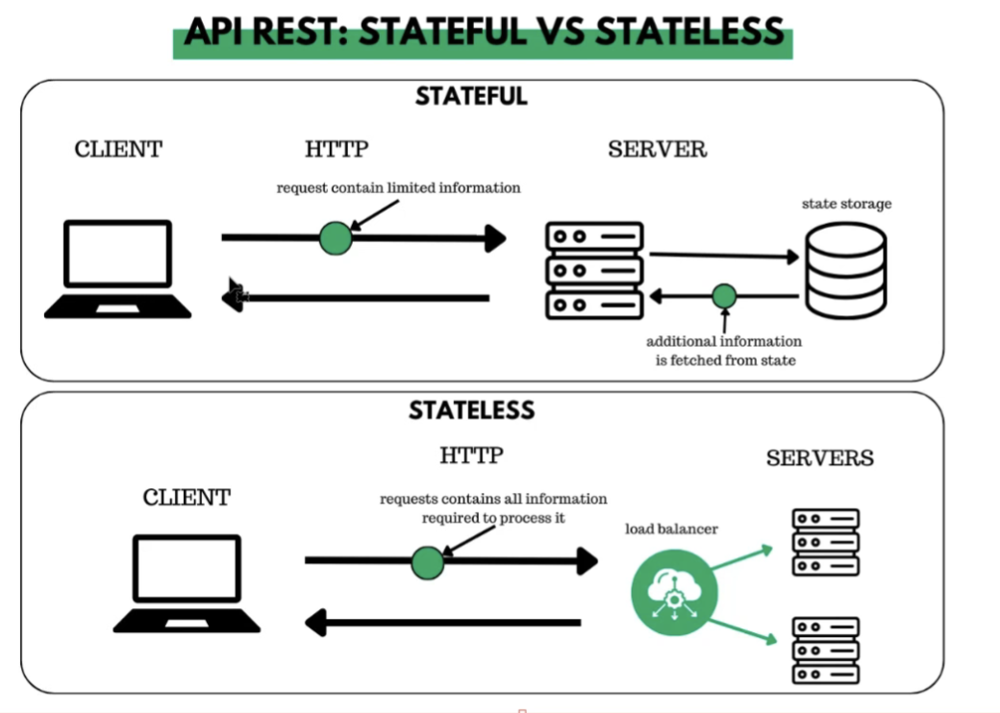

# API Fundamentals

## What is an API?
- Application Programming Interface
- interface to connect to systems/services
- e.g. for a database 
  - direct access isn't given, instead an interface in between to request from
- provides access to data or ask for certain action to be done
- built to represent and give access to certain resources
- often to access resources such as customer data, images,videos, web pages

## Why use APIs as Level 2 Support Engineers?
- Retrieve and manipulate data from external systems and services
- manual or automated interactions with cloud systems, infrastructure, 
  - especially to perform configuration or administrative actions
- to help investigate, troubleshoot, diagnose and resolve issues
- simulate a user's action or workflow to try to reproduce the issue

## RESTful services/APIs
- REST: Representational State Transfer
- refers to the type of architecture for the API
- primarily for building web services that are lightweight, scalable, maintainable

## Design promises for REST APIs:
- Representation & data flow (usually uses JSON or XML data formats)
- messages
- URIs / naming of resources
- stateless
- caching

## HTTP messages
- Use HTTP as the protocol
- can use HTTPS if needs to be encrypted
- Request structure: 
- Response structure: 
- 200s - good
- 300s - redirection
- 400s - client side error
- 500s - server side errors

## Stateful vs stateless
- Stateless - every request has to include ALL information necessary for a response
  - previous requests are not kept track of
- stateful requests:
  - http://ourservice/customer/1
  - http://ourservice/nextcustomer
  - knows that customer ID 1 has already been requested so it knows what the next customer is without giving a number
- stateless requests:
  - http://ourservice/customer/1
  - http://ourservice/customer/2
  - has to be told specifically to requests customer 2 because it doesn't know that the last request was 1
- 
- caching makes up for being stateless
  - general storage in memory things that a re often or recently requested
  - not for specific users - general
  - faster performance without tracking user state
  