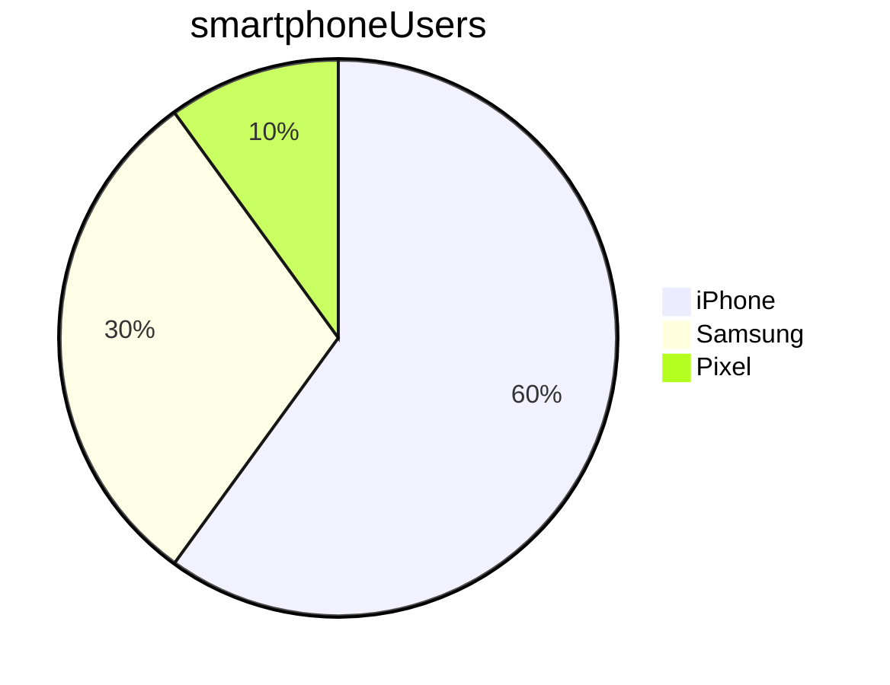

# Markdown Fundamentals

<!-- TOC -->
* [Markdown Fundamentals](#markdown-fundamentals)
  * [How to do headings](#how-to-do-headings)
    * [Example of a sub-subheading](#example-of-a-sub-subheading)
  * [General formatting](#general-formatting)
  * [Lists](#lists)
  * [Numbered lists](#numbered-lists)
  * [Images](#images)
  * [Links](#links)
  * [Code](#code)
  * [Task list](#task-list)
  * [Table](#table)
  * [Mermaid](#mermaid)
<!-- TOC -->

## How to do headings

Use more hashes for smaller headings

### Example of a sub-subheading

## General formatting
_Italics_

*This is also italics*

**Bold**

__This is also in bold__

> To be or not to be, that is the question
>> W. Shakespeare

## Lists

* item 1
* item 2
  * subitem 1
    * sub-subitem 1
    * sub-subitem 2
  * subitem 2

## Numbered lists

Use numbered lists when sequence is important

1. first item
   * unordered sub-list
2. second item
3. third item

- Note: can use hyphens instead of stars

## Images


## Links

To a website: 
[Google](https://google.com)

To a folder/file in your repo:
[README.md](../learn_variables/README.md)

## Code

Inline code example: 
To print something to the screen in python, use the `print()` function

Example of code over multiple lines:
```python
print('Hello')
print('Hello')
```

```
pwd
cd foldername
```

## Task list

- [ ] Item not done yet
- [x] This item is done

## Table

| Name  | Street      | Town       |
|-------|-------------|------------|
| Cathy | Main St     | Birmingham |
| John  | Maple Drive | Stafford   |

## Mermaid

