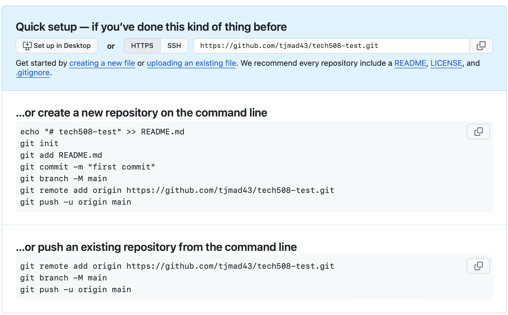

# Version Control

## Version Control System

### What/why?
- track changes to code/doc
- avoid manual version control - copying and renaming e.g. v1.1, v1.2
- easy to see previous version/work & rolling back changes
- who/when/what was changed
- compare changes

### Early version control
- often track changes to individual files rather than a set of files
- there was a base file, each version tracked using a delta (difference between base file, a delta added on each time)

### Centralised VCS vs a Distributes VCS like Git
- Centralised - file is downloaded to a user's computer and locked so no one else can edit at same time
- Distributed - repository is made on user's computer, file can be used and updates like any other file.
- Changes pushed and pulled from user's repository to repository on server

### 3 Stages of Commit
- `git init` to turn a folder into a git repo
- `git status` to check state
- `git add` to add to staging area
- `git add .` to add all in current folder/directory to staging area
- `git commit -m "commit message"` to commit. Message can be something like "change readme", present tense is standard

### Further notes:
- remove `.git` folder to uninitialise. All version control & commit history would be removed
- have to use `git config` options to log in before committing
- `git log` to see commit history
- `git diff` to see difference between 
- `git branch` to see branch
- `git checkout [commit ID]` to temporarily turn file/folder back to that commit for viewing
- `git checkout [branch name]` to go back. Branch name, usually main, goes to latest commit on that branch
- `git reset` to undo commit. Hard and soft versions, soft means changes aren't lost and you have the chance to recommit

### Linking to remote repo
